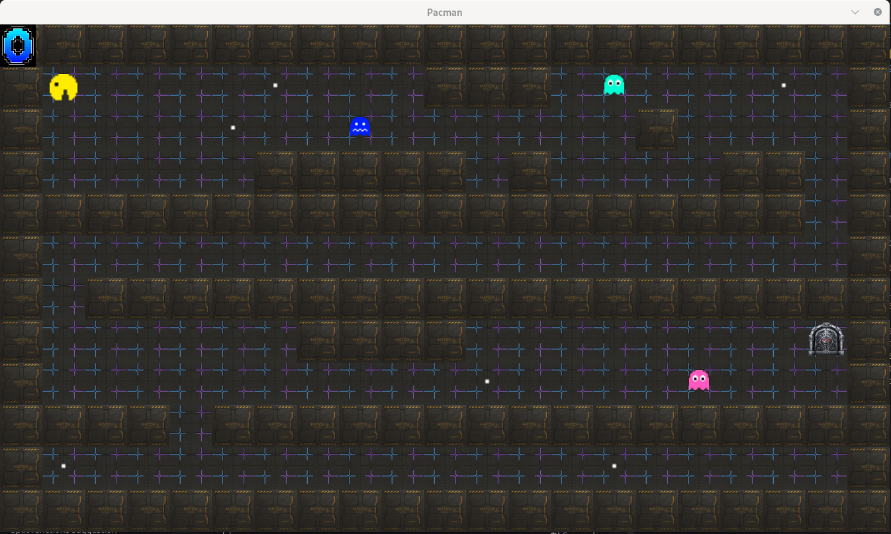

# 🟡 so_long

<div align="center">

**A simple 2D Pac-Man-style game built in C using MiniLibX**

*Collect all items and reach the exit without getting caught by the ghosts! 👻*



[](https://en.wikipedia.org/wiki/C_(programming_language))
[](https://42.fr/)
[](LICENSE)

</div>

---

## 📋 Table of Contents

- [🎮 About](#-about)
- [🧰 Requirements](#-requirements)
- [🚀 Installation & Usage](#-installation--usage)
- [🕹️ Controls](#️-controls)
- [🎯 Game Features](#-game-features)
- [💡 Notes](#-notes)
- [👨‍💻 Author](#-author)

---

## 🎮 About

**so_long** is a 2D game developed as part of the 42 School curriculum. Navigate through mazes, collect items, and avoid enemies while trying to reach the exit. The game is built using the MiniLibX graphics library and demonstrates fundamental game development concepts in C.

**Key Features:**
- 🎨 Retro-style 2D graphics
- 🔊 Sound effects for enhanced gameplay
- 👻 Enemy AI with different ghost behaviors
- 📊 Move counter and scoring system
- 🗺️ Custom map support (.ber format)

---

## 🧰 Requirements

### System Requirements
- **OS:** Linux or macOS
- **Compiler:** `gcc` or `clang`
- **Build Tool:** `make`
- **Graphics:** X11 libraries (Linux only)

### Installation Commands

**Ubuntu/Debian:**
```bash
sudo apt-get update
sudo apt-get install gcc make xorg libxext-dev libbsd-dev
```

**macOS:**
```bash
# Xcode command line tools (if not already installed)
xcode-select --install
```

---

## 🚀 Installation & Usage

### 1️⃣ Clone the Repository
```bash
git clone https://github.com/aboodjabr0/so_long.git
cd so_long
```

### 2️⃣ Build the Project
```bash
make
```

### 3️⃣ Run the Game
```bash
./so_long maps/map1.ber
```

### 🧹 Clean Build Files
```bash
make clean    # Remove object files
make fclean   # Remove all generated files
make re       # Rebuild everything
```

---

## 🕹️ Controls

| Key | Action |
|-----|--------|
| `W` / `↑` | Move up |
| `A` / `←` | Move left |
| `S` / `↓` | Move down |
| `D` / `→` | Move right |
| `ESC` | Quit game |

---

## 🎯 Game Features

- **🎵 Sound Effects:** Immersive audio feedback for actions
- **👻 Multiple Enemies:** Different ghost types with unique behaviors
- **🏆 Victory Conditions:** Collect all items and reach the exit
- **📊 Move Counter:** Track your efficiency
- **🗺️ Custom Maps:** Support for custom level design
- **⚡ Smooth Gameplay:** Optimized rendering and controls

---

## 💡 Notes

> **📦 Ready to Play:** The `mlx/` directory includes the MiniLibX library — no separate installation needed!

> **🖥️ Display Issues?** If the window doesn't open, ensure your system supports X11 and you have the required graphics libraries installed.

> **✅ Tested On:** Ubuntu 22.04, macOS Monterey, and various Linux distributions.

> **🗺️ Map Format:** Game uses `.ber` files for level definitions. Check the `maps/` directory for examples.

---

## 👨‍💻 Author

<div align="center">

**Abdullah Sauafth**

📧 [jabr.abood@yahoo.com](mailto:jabr.abood@yahoo.com)  
🐙 [GitHub Profile](https://github.com/aboodjabr0)

*Made with ❤️ for 42 School*

</div>

---

<div align="center">

**⭐ Star this repo if you found it helpful! ⭐**

</div>
